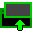

# Chrome detab

Chrome extension to turn any tab into a minimal pop-up window (and vice versa)

> [!NOTE]
>
> Moves the tab itself so the page is not reloaded and stays the way it is,
> as oposed to something like `window.open(location.href,"detab","toolbar=0");`
>
> Thus, also doesn't need permissions to read URLS, inject scripts, etc.

## Install

1. Clone this repo or download the `7z` file from releases (<https://github.com/MAZ01001/chrome_detab/releases>)
2. Unpack `zip`/`7z` (_get 7-Zip from <https://www.7-zip.org/>_)
3. Turn on dev-mode in <chrome://extensions> (top right)
4. Click _Load unpacked extension_ (top left)
5. Locate unpacked folder
6. Click it and then hit _Select folder_
7. ...
8. Profit

> [!IMPORTANT]
>
> This extension is NOT hosted in _Chrome Web Store_ and since loading extension from other sources does not work (since chrome M33 ~ 2014) for security reasons,
> the only way you could/should install this extension is by following the steps above

## Options

click on the extension in <chrome://extensions> and scroll to `options` (and click it)

> [!NOTE]
>
> The position origin for the custom window location is the top-left corner of the primary screen
>
> When `Same as source window`/`Same as source popup` is chosen, it tries to center the window relative to the source window/popup
>
> If size is set to `auto`, it's recommended to set location to `auto` as well (since centering wouldn't work and it'll align at the top-left corner of the source window/popup)

## Controls

> [!NOTE]
>
> Change extension hotkeys on <chrome://extensions/shortcuts>
>
> Select multiple tabs by clicking on them while holding <kbd>ctrl</kbd> and/or <kbd>shift</kbd>
>
> Move a tab inside a window with <kbd><kbd>ctrl</kbd>+<kbd>shift</kbd>+<kbd>PgUp</kbd></kbd>/<kbd><kbd>ctrl</kbd>+<kbd>shift</kbd>+<kbd>PgDn</kbd></kbd> (see [Chrome keyboard shortcuts](https://support.google.com/chrome/answer/157179#zippy=%2Ctab-and-window-shortcuts:~:text=Move%20tabs%20right%20or%20left "Google Chrome Help: Chrome keyboard shortcuts"))

<dl>
    <dt><b>Hotkeys</b></dt>
    <dd><dl>
        <dt><kbd><kbd>alt</kbd>+<kbd>0</kbd></kbd></dt>
        <dd>
            Toggle popup of last focused or selected tabs
            <li>last focused tab gets moved to a popup window</li>
            <li>last focused popup gets moved to the last focused normal window (left of active tab in that window)</li>
            <li>all selected tabs are each moved to a popup window (in order) and the popup that was the active tab is focused</li>
        </dd>
        <dt><kbd><kbd>alt</kbd>+<kbd>shift</kbd>+<kbd>0</kbd></kbd></dt>
        <dd>
            Create new window with last focused or selected tabs
            <li>last focused tab gets moved to a new window</li>
            <li>last focused popup gets moved to a new (non-popup) window</li>
            <li>all selected tabs are moved to a new window (same order) and are re-selected with the same active tab</li>
        </dd>
    </dl></dd>
    <dt><b>Clicking extension icon</b></dt>
    <dd>
        Create popup of current and selected tabs (<i>does nothing if somehow triggered from popup window</i>)
        <li>last focused tab gets moved to a popup window</li>
        <li>all selected tabs are each moved to a popup window (in order) and the popup that was the active tab is focused</li>
    </dd>
    <dt><b>Context menu</b></dt>
    <dd><dl>
        <dt><code>Popup toggle current tab</code> (on page)</dt>
        <dd>
            <li>current tab gets moved to a popup window</li>
            <li>current popup gets moved to the last focused normal window (left of active tab in that window)</li>
        </dd>
        <dt><code>Move to new normal window</code> (on page)</dt>
        <dd>
            <li>current tab gets moved to a new window</li>
            <li>current popup gets moved to a new (non-popup) window</li>
        </dd>
        <dt><code>Popup link</code> / <code>Popup incognito link</code> (on link elements)</dt>
        <dd>
            (<i>does nothing if link URL is not available</i>)
            <li>create popup from link URL</li>
            <li>create inconito popup from link URL</li>
        </dd>
        <dt><code>Popup media (source URL)</code> / <code>Popup incognito media (source URL)</code> (on image/video/audio elements)</dt>
        <dd>
            (<i>does nothing if media source URL is not available</i>)
            <li>create popup from media source URL</li>
            <li>create inconito popup from media source URL</li>
        </dd>
    </dl></dd>
</dl>

## Finding the last focused window

[`chrome.windows.getLastFocused()`](https://developer.chrome.com/docs/extensions/reference/api/windows#method-getLastFocused "Chrome API docs")
gets the last focused window, but [`chrome.windows.QueryOptions`](https://developer.chrome.com/docs/extensions/reference/api/windows#type-QueryOptions "Chrome API docs")
(parameter) can only distinguish between window types like `normal` and `popup`, and has no way of getting incognito/non-incognito windows separately

So, manual tracking of all focused windows is necessary

See `LastWindow` (static class) at the start of `background.js`
